## Introduction

### What is a Raspberry Pi?

Raspberry Pi is a small computer that can be used to build IoT projects. It is a low-cost, high-performance computer that is developed by the Raspberry Pi Foundation. It is a credit-card sized computer that plugs into a computer monitor or TV, and uses a standard keyboard and mouse. It is a capable little device that enables people of all ages to explore computing, and to learn how to program in languages like Scratch and Python. It’s capable of doing everything you’d expect a desktop computer to do, from browsing the internet and playing high-definition video, to making spreadsheets, word-processing, and playing games.

<div align="center">
  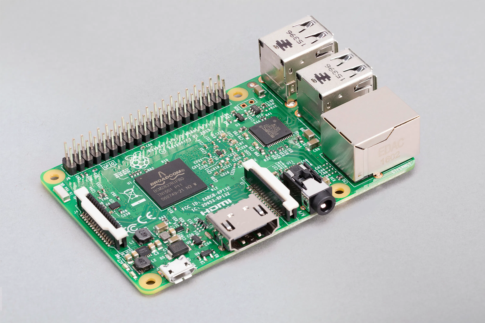
</div>

<!--
> Image Source: [Click Here](https://images.prismic.io/rpf-products/877fb653-7b43-4931-9cee-977a22571f65_3b+Angle+2+refresh.jpg?auto=compress%2Cformat&fit=max)
-->

### Why Raspberry Pi instead of Arduino Uno?

Unlike Arduino Uno, Raspberry Pi is a fully functional computer. It has a processor, RAM, and storage. It can run a full-fledged operating system (OS) like GNU/Linux. It can be used to build IoT projects that require a lot of processing power, memory, storage, and connectivity.

### Parts of a Raspberry Pi

> **NOTE:** The following parts are for Raspberry Pi 3 Model B. Other models may have different parts.

<div align="center">
  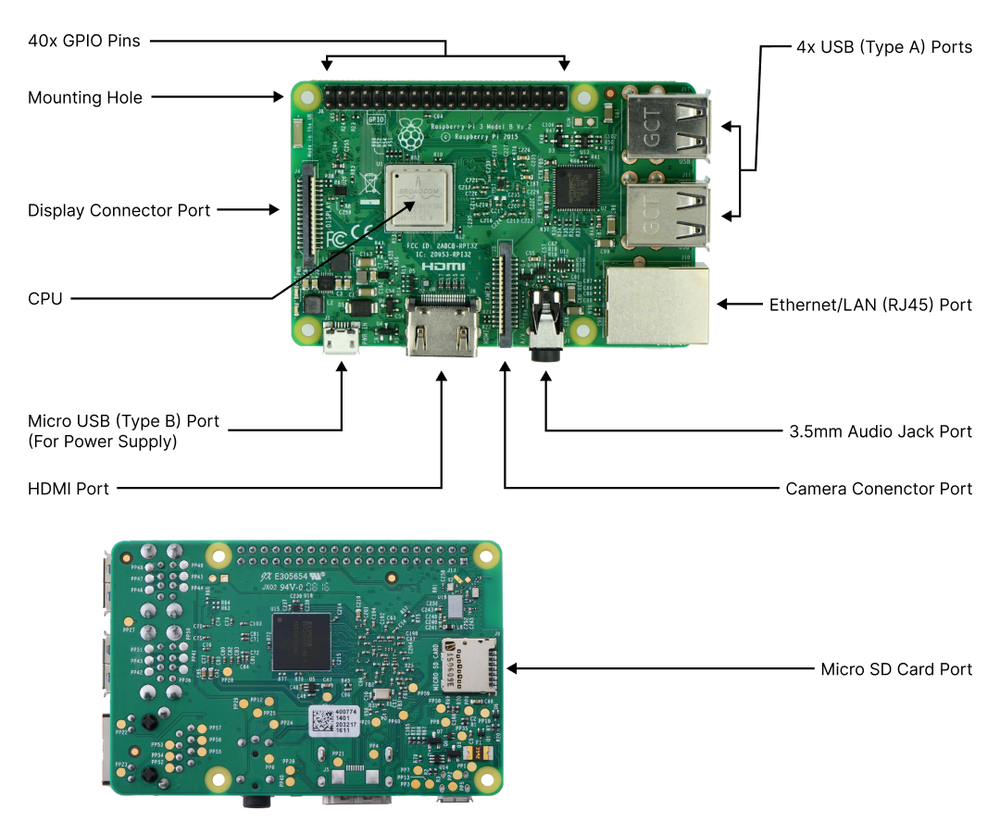
</div>

## QuickStart

### Pre-requisites

#### Hardware

- Raspberry Pi 3 Model B (or newer)
- MicroSD Card
- Power Supply (Micro USB Type B 5±0.25V 2.5A)
- A PC with SD Card Reader

#### Software

- [Raspberry Pi Imager](https://www.raspberrypi.org/software)
- [Python 3](https://www.python.org/downloads)
- [Visual Studio Code](https://code.visualstudio.com/download)
- [DietPi OS Image](https://dietpi.com/#downloadinfo)
- [Angry IP Scanner](https://angryip.org/download)

### Flashing the OS Image to MicroSD Card

In this section, we will flash the DietPi OS Image to the MicroSD Card using the Raspberry Pi Imager.

**Step 1:** Launch Raspberry Pi Imager

<div align="center">
  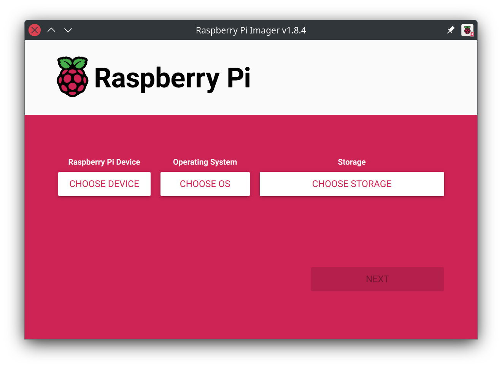
</div>

**Step 2:** Click on "CHOOSE DEVICE" and select "Raspberry Pi 3"

> **NOTE:** If you are using a different Raspberry Pi model, select the appropriate model from the list accordingly and proceed.

<div align="center">
  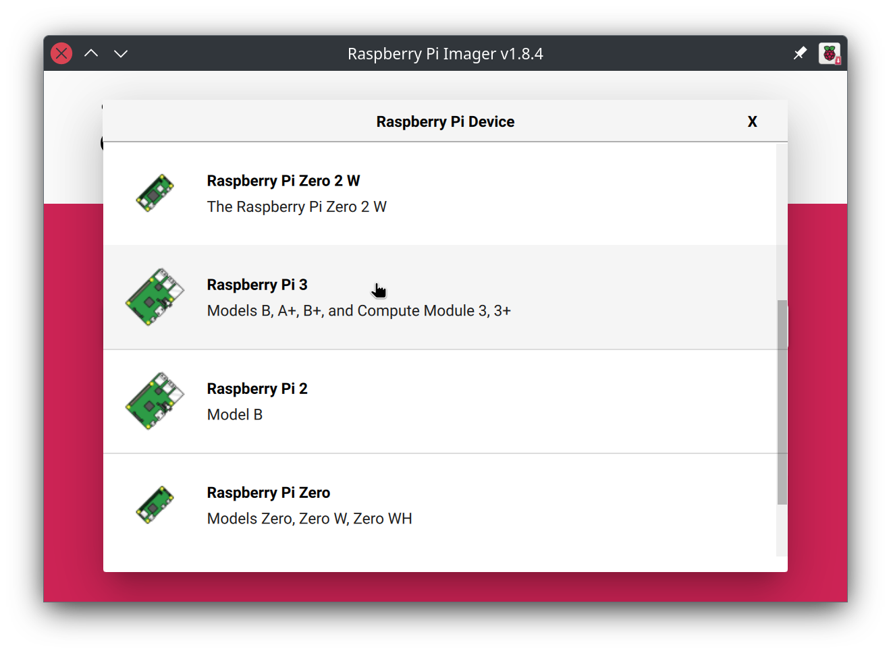
</div>

**Step 3:** Click on "CHOOSE OS", Scroll to the bottom of the list and select "Use custom" option, then select the DietPi OS Image file that you downloaded for your Raspberry Pi model from the [DietPi website](https://dietpi.com/#downloadinfo).

<div align="center">
  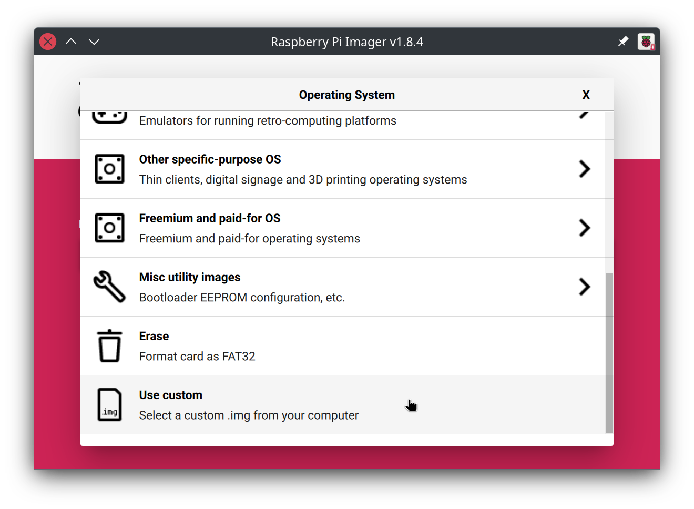
</div>

**Step 4:** Click on "CHOOSE STORAGE" and select the MicroSD Card that you want to flash the DietPi OS Image to, and then click on "NEXT".

**Step 5:** For the "Use OS Customisation?" Popup, select "NO" and for the "Warning" Popup, select "YES".

**Step 6:** Wait for the flashing process to complete.

<div align="center">
  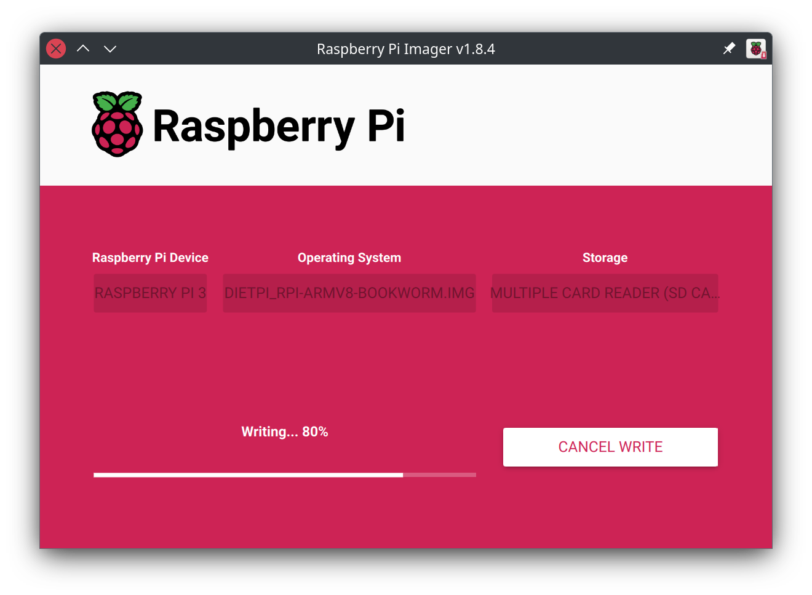
</div>

**Step 7:** Once the flashing process is complete, click on "CONTINUE" and then close the Raspberry Pi Imager.

### Editing the Configuration Files

**Step 1:** Remove the MicroSD Card from the PC and plug it back in once again to modify the files on the MicroSD Card.

**Step 2:** Open the MicroSD Card in File Explorer and navigate to it. This partition is called the "boot" partition and contains the files that are required to boot the Raspberry Pi.

> **NOTE:** If you are not using Windows, mount and open the smaller partition of the MicroSD Card in your file manager and navigate to it.

<div align="center">
  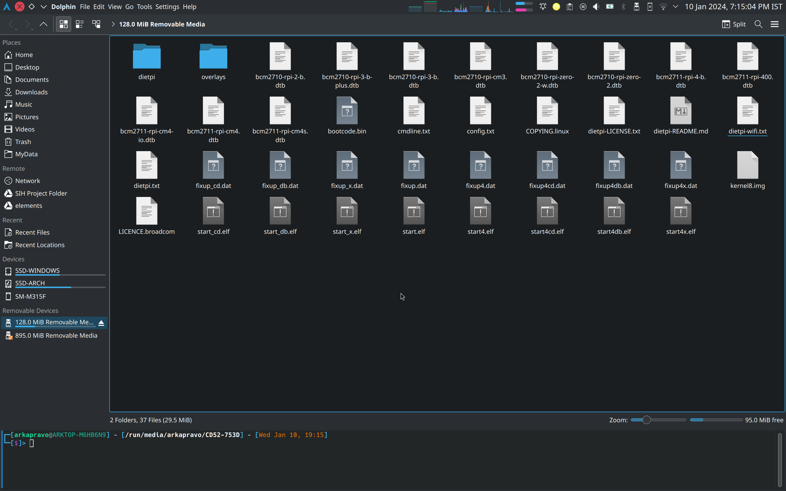
</div>

**Step 3:** Open the file "dietpi-wifi.txt" and enter your WiFi SSID and Password in the file and save it.

> **NOTE:** Your WiFi SSID and Password are case-sensitive, and the same Wi-Fi should be used by the Raspberry Pi and the PC.

<div align="center">
  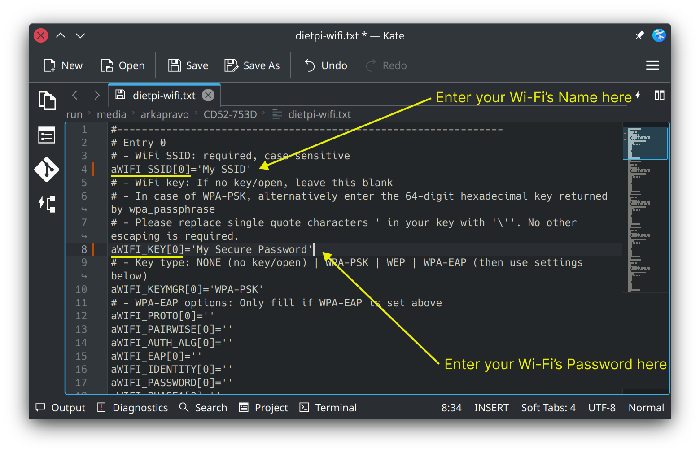
</div>

**Step 4:** Open the file "dietpi.txt" and change the following values as shown in the image below:

`AUTO_SETUP_LOCALE=en_US.UTF-8`

`AUTO_SETUP_TIMEZONE=Asia/Kolkata`

`AUTO_SETUP_NET_WIFI_ENABLED=1`

`AUTO_SETUP_NET_WIFI_COUNTRY_CODE=IN`

<div align="center">
  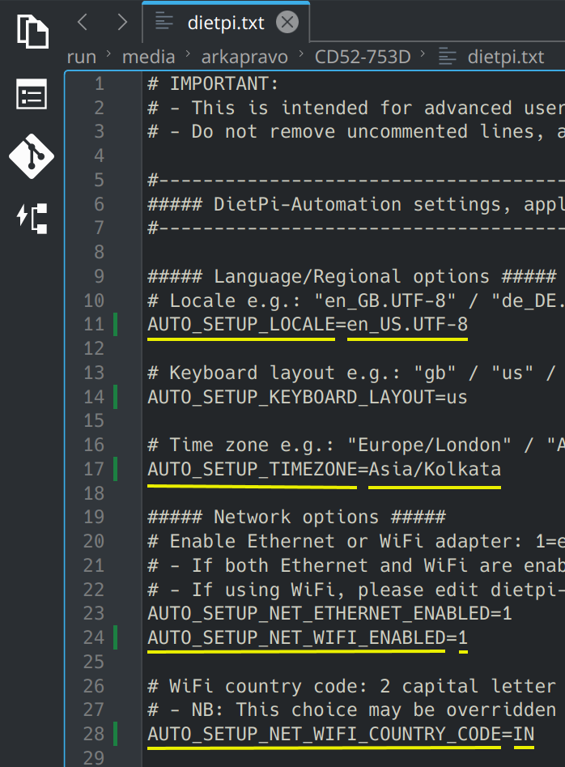
</div>

**Step 5:** Save the file and close it, then eject the MicroSD Card from the PC.

### Connecting to the Raspberry Pi and Basic Setup

In this section, we will connect the Raspberry Pi to the PC through a network protocol called SSH (Secure Shell) and perform some basic setup.

#### Searching for the Raspberry Pi on the Network

**Step 1:** Plug in the Micro SD Card to the Raspberry Pi

**Step 2:** Launch Angry IP Scanner on PC and click on the Settings icon (Or go to Tools > Preferences from the menu bar)

<div align="center">
  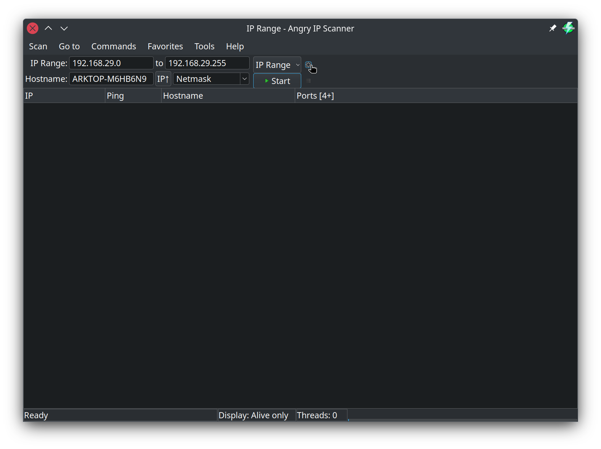
</div>

**Step 3:** Click on the "Ports" tab and append `22` in "Port Selection" field.

> **NOTE:** Port 22 is generally used for SSH (Secure Shell) connections.

<div align="center">
  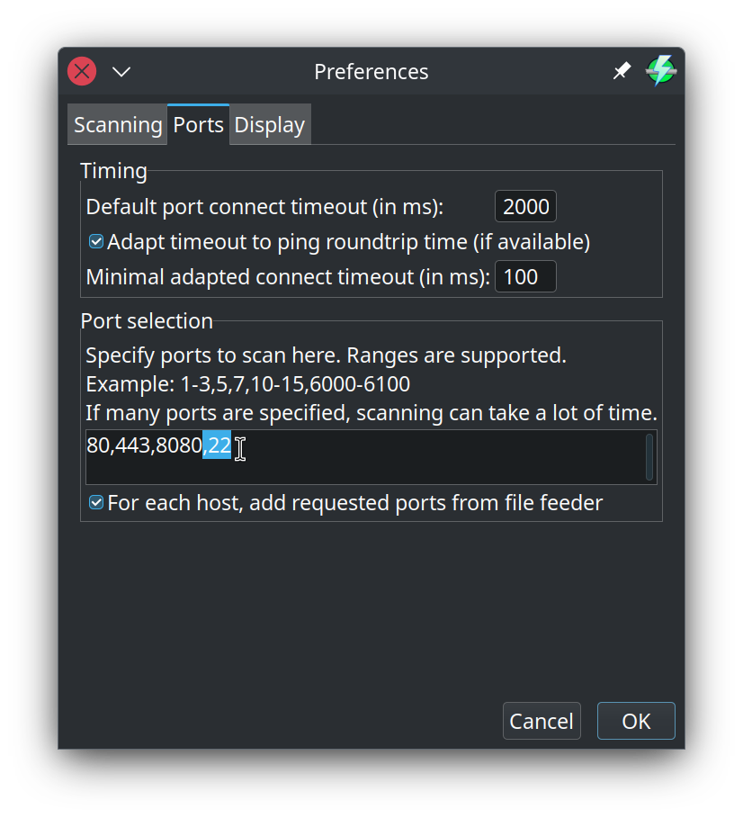
</div>

**Step 4:** Click on the "Display" tab and select "Hosts with open ports only" in the "Display in the results list" field, then click on "OK".

<div align="center">
  
</div>

**Step 5:** Click on the "Start" button to start scanning for devices on the network, and wait for it to scan. Once the scan is complete, Close the "Scanning Statistics" popup window. You should see a list of devices on the network that have the given ports open. Look for the IP Address that has the port 22 open and note it down.

<div align="center">
  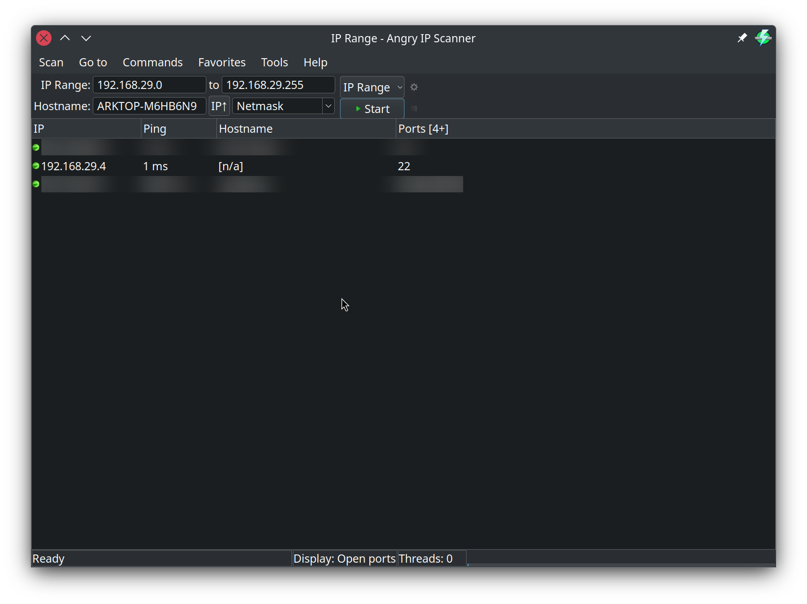
</div>

> **NOTE:** In This Case, the IP Address of the Raspberry Pi is `192.168.29.4` and might be different for you depending on your network.

#### Connecting to the Raspberry Pi

SSH (Secure Shell) is a network protocol that allows secure remote shell access over an encrypted connection. We will use SSH to connect to the Raspberry Pi and perform some basic setup.

**Step 1:** Open a Terminal and type the following command to connect to the `root` user of Raspberry Pi using SSH:

> **NOTE:** Windows users should use Windows Terminal or PowerShell instead of Command Prompt.

```pwsh
ssh root@<IP Address>
```

> **NOTE:** Replace `<IP Address>` with the IP Address of the Raspberry Pi that you noted down in the previous section.

> **NOTE:** If you get a remote host identification has changed warning upon reinstallation, run the following command to remove the old host key:
>
> ```bash
> ssh-keygen -R <IP Address>
> ```

**Step 2:** For the host authenticity warning, type "yes" and press enter.

**Step 3:** For the password prompt, type "dietpi" and press enter.

> **NOTE:** The password will not be visible while typing.

<div align="center">
  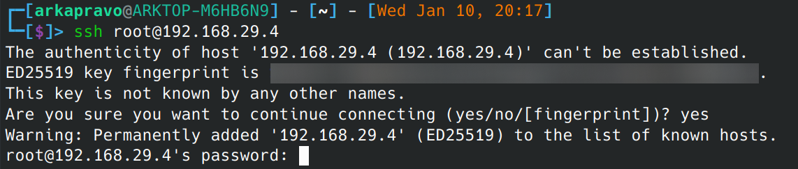
</div>

**Step 4:** Once you are connected to the Raspberry Pi an Automatic Setup will start. Wait for the setup to complete. This will take a few minutes depending on your internet connection speed.

**Step 5:** You shall now see DietPi Survey on the terminal as a **Terminal User Interface (TUI)**. Use arrow keys to navigate through options in the TUI, select `Opt OUT and purge uploaded data`, press Tab to navigate to the `<Ok>` button and press Enter to select it.

<div align="center">
  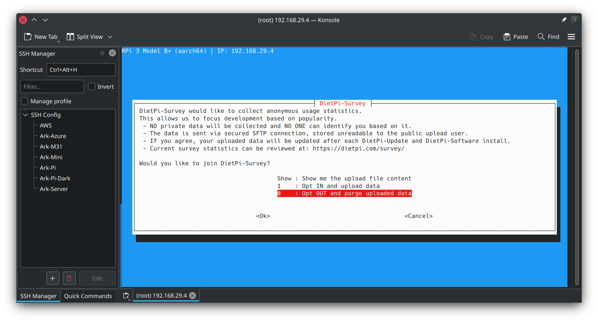
</div>

**Step 6:** Once the survey is complete, you will be asked to change the Global Software Password. Select `<Ok>` and press Enter to continue, then enter a Strong Password and Enter it, similarly set the UNIX Password as well.

**Step 7:** For the "Serial Console" popup, select "No".

<div align="center">
  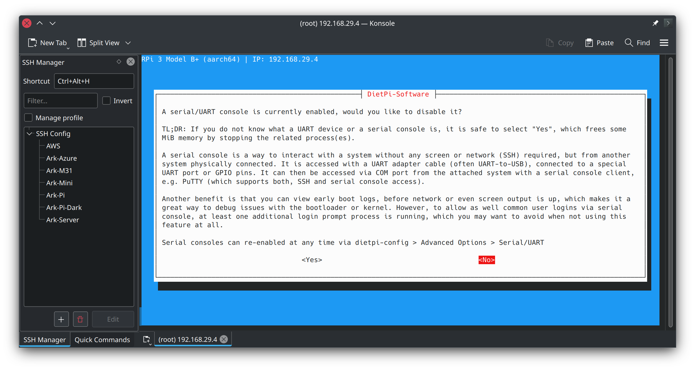
</div>

**Step 8:** For the `DietPi-Software` popup, Navigate to `SSH Server` and change it to `OpenSSH`. Then navigate to `Install` and select `<Ok>` and press Enter to continue and do the same again, Wait for the setup to complete.

<div align="center">
  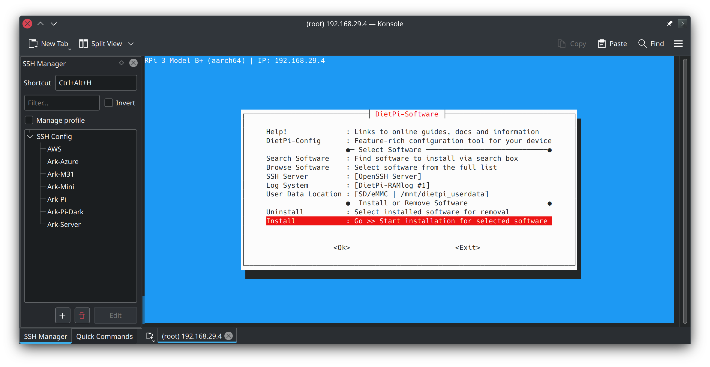
</div>

Upon completion, your terminal should look like this:

<div align="center">
  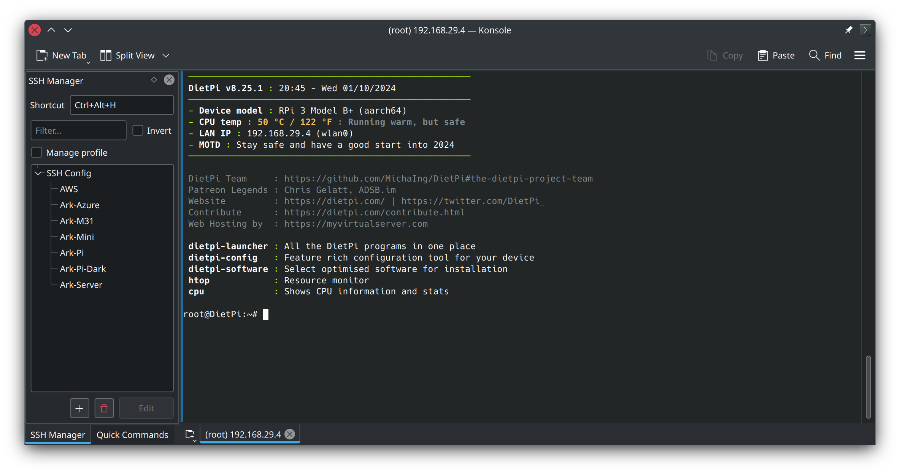
</div>

**Step 9:** Type `exit` and press Enter to exit the SSH connection.

**Step 10:** Remove Old Host Key from the Raspberry Pi using the following command:
`ssh-keygen -R <IP Address>`

> **NOTE:** Replace `<IP Address>` with the IP Address of the Raspberry Pi.

**Step 11:** Generate a new SSH key for your PC (if you don't have one already) using the following command:

```bash
ssh-keygen -t rsa -b 4096
```

> **NOTE:** This will generate New SSH Private and Public key using RSA encryption with 4096 bits. The private key will be stored in `~/.ssh/id_rsa` and the public key will be stored in `~/.ssh/id_rsa.pub` on your PC (In Windows it will be stored in `%USERPROFILE%\.ssh\id_rsa` and `%USERPROFILE%\.ssh\id_rsa.pub` respectively).

**Step 12:** Print the contents of the public key using the following command (Windows PowerShell):
`cat $env:USERPROFILE\.ssh\id_rsa.pub`

> **NOTE:** Non-Windows users can use `cat ~/.ssh/id_rsa.pub` instead.

> **TIP:** Non-Windows users can skip from Step 12 to Step 18 and instead use the following command to copy the public key to the Raspberry Pi easily:
>
> ```bash
> ssh-copy-id dietpi@<IP Address>
> ```

**Step 13:** Copy the output of the above command using Ctrl + Shift + C

> **TIP:** Windows users can enable Clipboard History by pressing Windows Key + V to paste the output of the above command. This will allow you to paste the output of the command without having to copy it again next time, until you Restart your PC or clear the Clipboard History.

**Step 14:** Connect to the Raspberry Pi again using the following command:

```bash
ssh dietpi@<IP Address>
```

**Step 15:** Enter your password and press Enter like before. Use the UNIX Password that you set in one of the previous steps. Once you are connected to the Raspberry Pi, your prompt should look like this:

<div align="center">
  
</div>

**Step 16:** Create a new directory called `.ssh` in the home directory of the `dietpi` user using the following command:

```bash
mkdir ~/.ssh
```

**Step 17:** Open GNU Nano editor on the new file `~/.ssh/authorized_keys` using the following command:

```bash
nano ~/.ssh/authorized_keys
```

**Step 18:** Paste the contents of the public key that you copied earlier into the file using Ctrl + Shift + V, press Ctrl + S to save the file, and press Ctrl + X to exit the editor.

> **NOTE:** Doing this will allow you to connect to the Raspberry Pi without having to enter the password every time. This is because the SSH client on your PC will use the private key to authenticate with the SSH server on the Raspberry Pi, and the SSH server will allow the connection because the public key is present in the `~/.ssh/authorized_keys` file.

**Step 19:** Enter the following command to give access to gpio pins to the current user:

```bash
sudo usermod -aG gpio $USER
```

> **NOTE:** Any command that requires root privileges should be run with `sudo` command.

**Step 20:** Exit the SSH connection by typing `exit` like before. Next time use this user to connect to the Raspberry Pi instead of the `root` user unless necessary.

#### Connecting to the Raspberry Pi using VS Code SSH Extension

**Step 1:** Launch Visual Studio Code and Install the Remote Development Extension Pack by Microsoft.

<div align="center">
  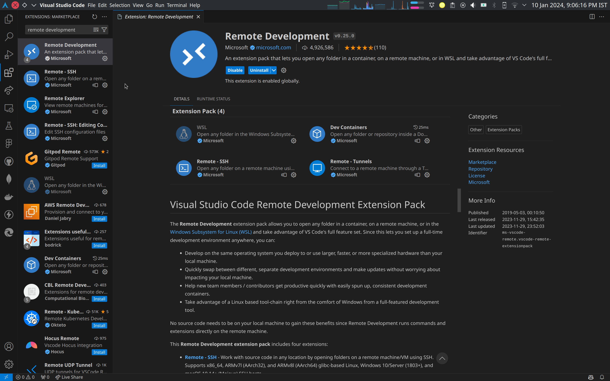
</div>

**Step 2:** Look for the following button in the bottom left corner of VS Code and click on it. This is the Remote Extension.

<div align="center">
  
</div>

**Step 3:** Click on "Connect to Host..." and select "+ Add New SSH Host...", then enter the connection command as follows, and press Enter:

```bash
ssh dietpi@<IP Address>
```

**Step 4:** Again open the Remote Extension, click on "Connect to Host..." and select the connection that you just added. VS Code will now connect to the Raspberry Pi in a new window. Wait for the setup to complete.

<div align="center">
  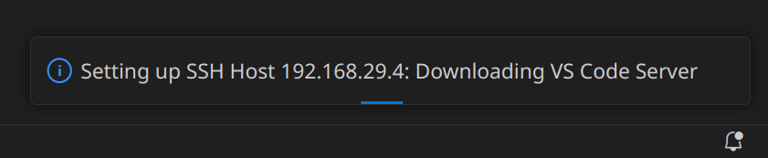
</div>

**Step 5:** Once the setup is complete, you will be asked to select a folder to open in VS Code. Select "Open Folder" and navigate to the `/home/dietpi` directory and select it. This is the home directory of the `dietpi` user.

<div align="center">
  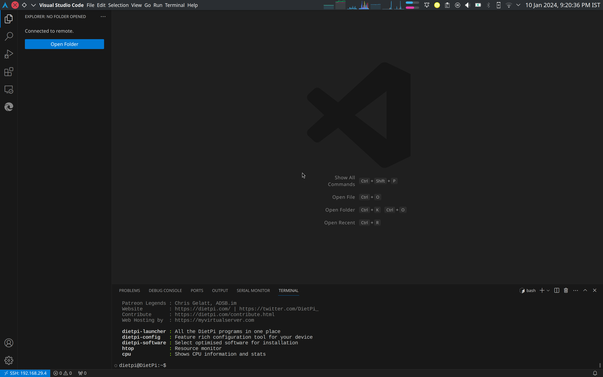
</div>

**Step 6:** Once the folder is opened, create a new file called `test.py` and click "Install" when prompted to install the Python extension in VS Code.

**Step 7:** Expand the Terminal within VS Code and type `sudo dietpi-software` to run `dietpi-software` command as `root` user, select "Search Software", search for "python" and select `Python 3 RPi.GPIO: Control Raspberry Pi GPIO channels in Python 3` and `Python 3: Runtime system, pip package installer and development headers` by pressing Spacebar, then select `<Confirm>` using Tab key and press Enter to continue.

<div align="center">
  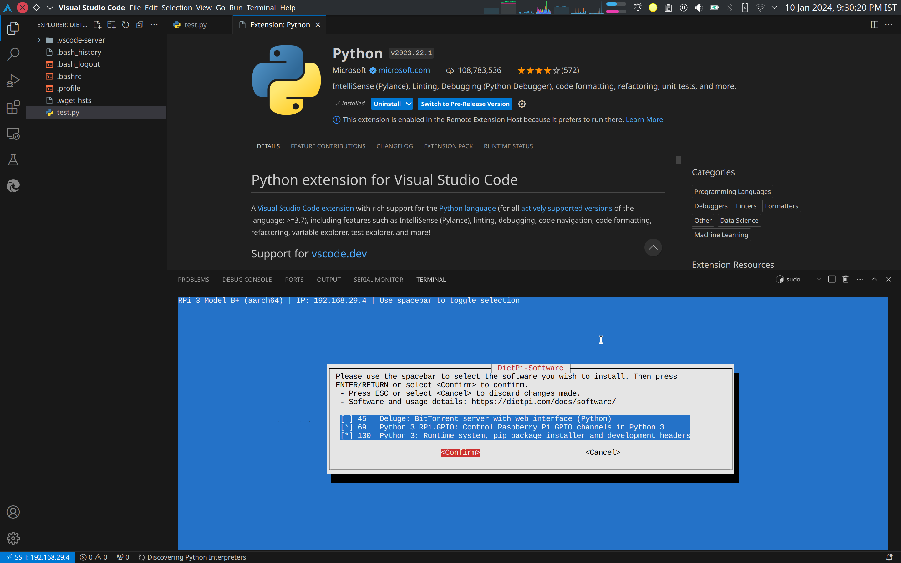
</div>

**Step 8:** Navigate to `Install` and select `<Ok>` and press Enter to continue. For the installation beginning screen, select `<Ok>` and press Enter to continue. Wait for the installation to complete.

**Step 9:** You should now be ready to write code for Raspberry Pi and run it.

<div align="center">
  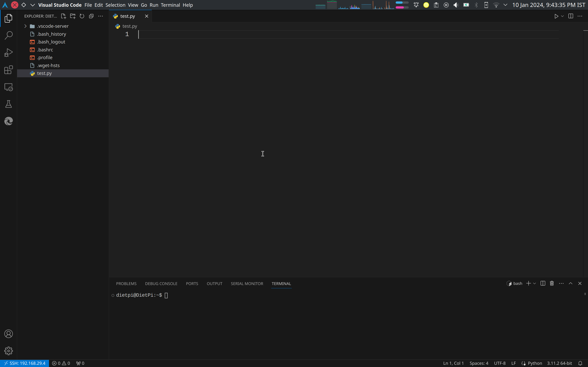
</div>

## Raspberry Pi GPIO

### What is GPIO?

GPIO stands for General Purpose Input Output. It is a set of pins on the Raspberry Pi that can be used to connect and control external electronic components. These pins can be used to read inputs from sensors and switches, and to control outputs to motors, LEDs, and other electronic components.

There are 40 GPIO Pins as shown in the following Pinout Diagram:

<div align="center">
  
</div>

> **NOTE:** The Pin Numbers as given in the image from 1 to 40 would be used in the code, not the GPIO Numbers or names.

### Blinking an LED using Raspberry Pi

This section is like a "Hello World" program for Raspberry Pi. In this section, we will write a Python program to blink an LED connected to the Raspberry Pi.

**Step 1:** Connect an LED's Anode (Longer Leg) to GPIO Pin 14 (Pin Number 8) and Cathode (Shorter Leg) to Ground (Pin Number 6) using a 220Ω Resistor.

**Step 2:** Create a file in Raspberry Pi via SSH using VS Code and name it `blink.py` and paste the following code in it:

```py
#!/bin/python3
import RPi.GPIO as GPIO # Import Raspberry Pi GPIO Library
from time import sleep # Import sleep function from time module

GPIO.setmode(GPIO.BOARD) # Use Physical Pin Numbering Scheme

led_pin = 8 # Set to Pin Number 8
delay = 1 # Set blink delay in seconds

GPIO.setup(led_pin, GPIO.OUT, initial=GPIO.LOW) # Set led_pin as Output and its Initial State as LOW

try: # Watch for exceptions within this block
    while True:  # Run forever
        GPIO.output(led_pin, GPIO.HIGH)  # Turn on
        sleep(delay) # Wait
        GPIO.output(led_pin, GPIO.LOW)  # Turn off
        sleep(delay) # Wait
except KeyboardInterrupt: # Run when Ctrl + C is pressed in the terminal
    GPIO.cleanup() # Clean up all the pins
    print("\nProcess killed by user")
```

**Step 3:** Navigate to the directory where the file is located in the terminal and give the file execute permissions using the following command:

`chmod +x blink.py`

**Step 4:** Run the file using the following command:

`./blink.py`
